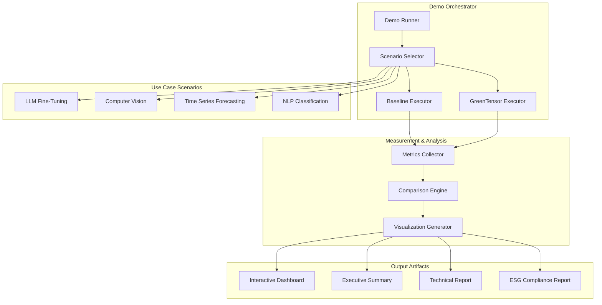

# Design Document: Real-World Use Case Demonstration

## Overview

This design outlines a comprehensive real-world demonstration system for GreenTensor that showcases its value proposition through realistic ML training scenarios. The demonstration will compare baseline training (without GreenTensor) against optimized training (with GreenTensor) across multiple industry-relevant use cases, providing measurable environmental impact, cost savings, security monitoring, and compliance reporting. The system will be designed for easy execution by potential users, investors, and stakeholders, with clear before/after comparisons and compelling visualizations.

The demonstration targets three primary audiences: (1) ML engineers evaluating sustainability tools, (2) executives assessing ESG compliance solutions, and (3) investors evaluating GreenTensor's market potential. Each use case will demonstrate tangible ROI through energy reduction, carbon savings, water impact, security threat detection, and regulatory compliance automation.

## Architecture



## Main Workflow Sequence

```mermaid
sequenceDiagram
    participant User
    participant DemoRunner
    participant BaselineExecutor
    participant GTExecutor as GreenTensor Executor
    participant MetricsCollector
    participant ComparisonEngine
    participant ReportGenerator
    
    User->>DemoRunner: run_demo(scenario="llm-finetuning")
    DemoRunner->>BaselineExecutor: execute_baseline()
    BaselineExecutor->>MetricsCollector: record_baseline_metrics()
    DemoRunner->>GTExecutor: execute_with_greentensor()
    GTExecutor->>MetricsCollector: record_gt_metrics()
    MetricsCollector->>ComparisonEngine: compare_metrics()
    ComparisonEngine->>ReportGenerator: generate_reports()
    ReportGenerator-->>User: dashboard + reports
